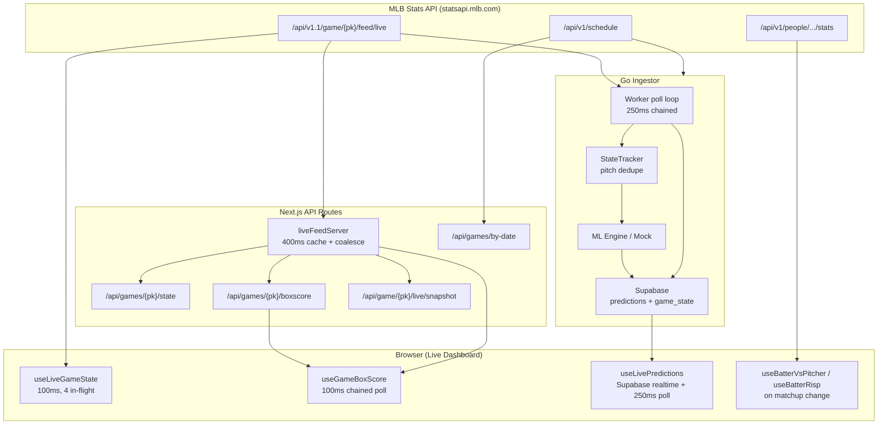
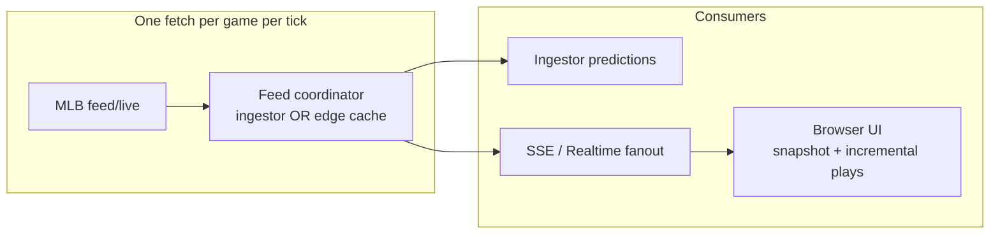

# MLB API Real-Time Fetch Audit

**Date:** 2026-06-26  
**Scope:** How this repo fetches live data from `statsapi.mlb.com`, end-to-end latency characteristics, and prioritized improvements for speed and data quality.

---

## Executive Summary

The system has **two independent real-time pipelines** that both poll the same MLB endpoint (`/api/v1.1/game/{gamePk}/feed/live`):

1. **Go ingestor** — server-side, ~250ms per game, drives ML predictions and optional Supabase `game_state` persistence.
2. **Next.js web client** — browser-side direct MLB fetches for the live dashboard (~100ms interval, up to 4 concurrent requests), plus separate server-proxied polls for box score.

The architecture is thoughtful about **play-by-play correctness** (merging `currentPlay` over stale `allPlays` tails, incremental PBP parsing, pitch deduplication in the ingestor). The main cost is **redundant full-feed downloads**: every poll pulls the entire live JSON blob even when only a pitch or two changed, and multiple consumers fetch the same game independently.

---

## Architecture Overview



---

## MLB Endpoints in Use

| Endpoint | API version | Used by | Purpose |
|----------|-------------|---------|---------|
| `GET /game/{gamePk}/feed/live` | v1.1 | Ingestor, browser (`useLiveGameState`), Next.js cache layer | Full live feed: linescore, `currentPlay`, `allPlays`, boxscore embed |
| `GET /schedule` | v1 | Ingestor, `schedule.ts`, `scheduleRow.ts`, `/api/games` | Slate, scores, status, probable pitchers |
| `GET /people?personIds=...&hydrate=stats(...)` | v1 | `schedule.ts` | Probable pitcher season lines on slate cards |
| `GET /people/{id}/stats?stats=vsPlayerTotal` | v1 | `/api/matchup` | Batter vs pitcher career |
| `GET /people/{id}/stats?stats=statSplits&sitCodes=risp` | v1 | `/api/batter/risp` | Batter RISP season stats |

**Primary real-time bottleneck:** the live feed endpoint returns the **entire game JSON** on every request. Payload size grows linearly with innings played (all prior `allPlays`, embedded box score, pitch-level `playEvents`).

---

## Pipeline 1: Go Ingestor

### Configuration (defaults)

| Setting | Default | Location |
|---------|---------|----------|
| `POLL_INTERVAL` | 250ms | `ingestor/internal/config/config.go` |
| `MLB_API_BASE_URL` | `https://statsapi.mlb.com/api/v1.1` | same |
| `HTTP_CLIENT_TIMEOUT` | 10s | same |
| `HTTP_MAX_RETRIES` | 3 (exponential backoff) | same |
| `SCHEDULE_REFRESH_INTERVAL` | 5m | same |
| Max concurrent games | 15 | same |

### Poll loop (`ingestor/internal/mlb/poller.go`)

- **Chained timing:** next poll starts after work completes; sleep only fills the gap to `PollInterval`.
- **Per poll:** `FetchLiveFeedRaw` → unmarshal → `ToGameState` → `StateTracker.PendingStates` → `onChange` (predictions) → async Supabase `game_state` write.
- **Predictions are prioritized** over Supabase writes; live state persistence is fire-and-forget with a single in-flight guard per game (drops overlapping writes).

### HTTP client (`ingestor/internal/mlb/client.go`)

- Tuned `http.Transport`: keep-alive, HTTP/2, `MaxIdleConnsPerHost: 15`, retry on 5xx/429/timeouts.
- **No conditional requests** (ETag / `If-None-Match`).
- **No response streaming** — full body read + JSON unmarshal every poll.

### State tracking (`ingestor/internal/mlb/tracker.go`)

- Tracks last seen pitch `playId` per game; emits **all unseen pitches** between polls (handles fast sequences).
- On new at-bat, resets pitch history to avoid carrying previous AB events.
- Commits fingerprint only after successful downstream write.

### Post-game (`ingestor/internal/mlb/feedsync.go`)

- On game end: `CacheGameFeed` with up to 6 attempts, 15s backoff, waits for MLB `Final` status.
- Background reconciliation for missing or stale archived feeds.

### Strengths

- Low poll interval with connection reuse across up to 15 games.
- Robust retry and pitch-level deduplication.
- Schedule auto-discovery with carryover from prior ET day.

### Weaknesses

- Full feed fetch every 250ms × N live games = significant MLB API load from a single ingestor instance.
- `game_state` Supabase writes can be **dropped** when a prior write is still in flight (`enqueueLiveStateWrite` returns early).
- Schedule client uses a **separate** `scheduleAPIBase` (v1) from live feed client (v1.1) — fine, but no shared caching between them.

---

## Pipeline 2: Web Client (Live Dashboard)

### Live game state — direct MLB (`useLiveGameState`)

| Parameter | Value | File |
|-----------|-------|------|
| Poll interval | 100ms | `web/hooks/useLiveGameState.ts` |
| Max in-flight | 4 | same |
| Fetch target | `statsapi.mlb.com` directly (CORS) | `web/lib/mlb/liveFeed.ts` |

**Per poll:**

1. `fetchMLBLiveFeed(gamePk)` — full JSON from MLB CDN.
2. Fast parse with existing PBP entries → `setGameState` (optimistic UI).
3. Incremental or full PBP resync via `syncPlayByPlayFromFeed` / `rebuildPlayByPlayFromFeed`.
4. Second parse with updated entries → `setGameState` again.

**Optimizations already present:**

- `liveStateFingerprint` skips React updates when nothing material changed.
- `mergeAtBatPitches` appends only new pitch rows when possible.
- `isStaleRegression` guards against MLB briefly returning older snapshots.
- Tab visibility catch-up: rebuilds PBP after background throttling.
- `currentPlay` merged over `allPlays[-1]` for fresher pitch data.

### Box score — server proxy (`useGameBoxScore`)

| Parameter | Value | File |
|-----------|-------|------|
| Visible poll gap | 100ms | `web/hooks/useGameBoxScore.ts` |
| Hidden poll gap | 1000ms | same |
| Fetch target | `/api/games/{pk}/boxscore?live=1` | same |

Server route calls `getCachedLiveFeed` (400ms cache) and parses box score from the **same full live feed**.

### Predictions — Supabase only (`useLivePredictions`)

- Supabase Realtime `INSERT` on `predictions` + 250ms chained poll fallback.
- Does **not** call MLB directly; latency is bounded by ingestor poll interval + inference + DB write.

### Contextual stats — on demand

- `useBatterVsPitcher` / `useBatterRisp` fetch once per batter/pitcher or batter/RISP context change via Next API → MLB stats endpoints.
- Not on the hot pitch path; acceptable.

### Strengths

- Browser bypasses Next.js for pitch-critical path (saves one network hop).
- Overlapping polls (`useRapidPoll`) avoid serializing on slow round-trips.
- Sophisticated PBP incremental parsing with resync detection.

### Weaknesses

- **Duplicate MLB load:** `useLiveGameState` and `useGameBoxScore` each trigger separate full-feed fetches (browser + server cache are not shared).
- **Up to ~40 browser requests/second per game** (4 in-flight × 100ms tick) — likely exceeds what MLB expects from a single viewer; no backoff on errors.
- **Double JSON parse** per successful poll in `useLiveGameState`.
- `fetchLiveSnapshotWithPlays` / snapshot API exist but the live dashboard does not use them (full feed only).

---

## Pipeline 3: Next.js Server Cache Layer

### `getCachedLiveFeed` (`web/lib/mlb/liveFeedServer.ts`)

```text
CACHE_MS = 400
- Per-gamePk in-memory Map
- In-flight request coalescing (dedupe concurrent fetches)
- No TTL eviction beyond overwrite; no LRU cap
```

Used by: `/api/games/{pk}/state`, `/api/games/{pk}/boxscore`, `/api/game/{pk}/live`, `/api/game/{pk}/live/snapshot`, `/api/game/{pk}/live/plays`, `archiveGame`.

**Note:** `useLiveGameState` does **not** use this cache — it goes direct to MLB.

### Schedule paths

| Path | MLB calls | Poll interval |
|------|-----------|---------------|
| `useGamesByDate` (today) | `/api/games/by-date` → 3 schedule dates + DB overlay | 30s client |
| `/api/games` (slate refresh) | 3 ET dates + pitcher stats batch | on demand |
| Ingestor `syncSchedule` | 7 ET dates | 5m |

`/api/games/by-date` also kicks off **background** `syncScheduleDates` + `reconcileFinalFeedsForGames` on every request.

---

## Data Quality Assessment

### What works well

| Area | Mechanism |
|------|-----------|
| Pitch freshness | `currentPlay` merged into `allPlays` tail; ingestor `PendingStates` replays missed pitches |
| Walk / fast PA outcomes | `inferTerminalEventFromPlayEvents`, `resolvePlayResult` |
| PBP deduplication | `loggedAtBatIndices`, `loggedGameEventKeys`, `dedupePlayByPlayEntries` |
| Stale snapshot protection | `isStaleRegression`, fingerprint gating |
| Background tab recovery | visibility/focus catch-up + forced PBP rebuild |
| Archive completeness | multi-attempt `CacheGameFeed`, reconcile jobs |

### Known quality risks

| Risk | Cause | Impact |
|------|-------|--------|
| Dropped live `game_state` in DB | Single-writer guard in ingestor | Supabase-backed views lag; browser direct path unaffected |
| PBP resync edge cases | Complex incremental parser; MLB event taxonomy changes | Occasional missing game events; mitigated by `playByPlayNeedsResync` |
| Box score vs feed desync | Independent poll loops | Rare transient mismatch between scorebug and box score |
| No MLB push / websocket | Polling only | Latency floor = poll interval + RTT + parse; typically 200ms–2s |
| Rate limiting / 429 | No global coordinator | Errors silently swallowed in poll hooks; UI may freeze on stale data |
| `useGameState` fallback | 1s interval via Supabase/MLB proxy | Slower than `useLiveGameState`; used only for non-live historical hybrid view |

---

## Load Estimate (Single Live Game, One Viewer)

| Consumer | Requests/min (approx) | Payload |
|----------|----------------------|---------|
| Browser `useLiveGameState` | 240–600+ (100ms tick, up to 4 concurrent) | Full live feed |
| Browser `useGameBoxScore` | ~600 visible (100ms chained) | Full live feed (server) |
| Ingestor | ~240 | Full live feed |
| **Combined** | **~1,000+ full-feed fetches/min** | Grows with innings |

For 15 concurrent games with ingestor only: ~3,600 fetches/min from one process.

---

## Improvement Recommendations

Prioritized by impact. **P0** = highest leverage for speed/quality.

### P0 — Reduce redundant full-feed downloads

| # | Improvement | Speed | Quality | Effort |
|---|-------------|-------|---------|--------|
| 1 | **Unify live dashboard on one feed source per client** — fetch once, derive box score + game state locally (box score is already embedded in live feed via `parseBoxScore`). Remove parallel `useGameBoxScore` MLB poll during live play. | High | Medium | Low |
| 2 | **Use snapshot API for pitch-critical UI** — extend `useLiveGameState` to call `/api/game/{pk}/live/snapshot?playsFrom=N` or `fetchDirectSnapshot` pattern: server/coalesced fetch, client receives compact payload + incremental plays chunk. | High | Same | Medium |
| 3 | **Share a browser-side feed cache** — single `LiveFeedCoordinator` (module-level or React context) with one poll loop per `gamePk`, multiple subscribers (scorebug, PBP, box score). | High | Medium | Medium |

### P0 — Smarter polling

| # | Improvement | Speed | Quality | Effort |
|---|-------------|-------|---------|--------|
| 4 | **Adaptive poll rate** — 100ms only during active AB (`currentPlay` incomplete); backoff to 500ms–1s during breaks, pitching changes, between innings. | High | Same | Low |
| 5 | **Reduce `LIVE_FEED_MAX_IN_FLIGHT`** from 4 to 1–2 with adaptive interval; current setting can stampede MLB during slow responses. | Medium | Same | Low |
| 6 | **Conditional fetch probing** — if MLB supports `ETag` / `Last-Modified` on live feed (verify), send `If-None-Match` and skip body parse on 304. | High | Same | Medium |

### P1 — Server / ingestor efficiency

| # | Improvement | Speed | Quality | Effort |
|---|-------------|-------|---------|--------|
| 7 | **Central MLB fetch service** — one process (or Redis-cached layer) polls each live `gamePk` once, fans out via SSE/WebSocket to browsers and ingestor. | High | High | High |
| 8 | **Queue `game_state` writes** instead of dropping — keep latest snapshot, coalesce writes to Supabase. | Low | High | Low |
| 9 | **Align ingestor poll with UI needs** — if predictions only need pitch events, consider whether 250ms is necessary vs 500ms with tracker replay (measure inference latency first). | Medium | Same | Low |
| 10 | **Stream-parse JSON** — use `json.Decoder` path to `liveData.plays` / `currentPlay` without full struct unmarshal for ingestor hot path. | Medium | Same | High |

### P1 — Data quality

| # | Improvement | Speed | Quality | Effort |
|---|-------------|-------|---------|--------|
| 11 | **Observability** — log MLB fetch latency, payload bytes, 429 rate, parse time, `playByPlayNeedsResync` frequency per game. | — | High | Low |
| 12 | **Explicit error surfacing in poll hooks** — today `useRapidPoll` / `useChainedPoll` swallow errors; show stale-data indicator after N failures. | — | High | Low |
| 13 | **Golden-file PBP tests** — snapshot real MLB feed JSON at key moments (walk on 3-2, pickoff, ABS challenge) to lock parser behavior. | — | High | Medium |
| 14 | **`observedAt` from MLB** — prefer MLB play event timestamps over `new Date()` for ordering and latency measurement. | — | Medium | Low |

### P2 — Schedule & ancillary fetches

| # | Improvement | Speed | Quality | Effort |
|---|-------------|-------|---------|--------|
| 15 | **Cache schedule responses** server-side (30–60s TTL for today's slate). | Medium | Same | Low |
| 16 | **Debounce background sync** on `/api/games/by-date` — don't run `syncScheduleDates` + reconcile on every 30s client poll. | Medium | Same | Low |
| 17 | **Cache batter matchup / RISP stats** in memory or CDN (`revalidate: 3600`) — stats change slowly. | Medium | Same | Low |
| 18 | **Consolidate schedule fetch implementations** — three similar modules (`schedule.ts`, `scheduleRow.ts`, ingestor `schedule.go`); shared contract reduces drift. | — | Medium | Medium |

### P2 — Alternative data sources (research)

| # | Improvement | Notes |
|---|-------------|-------|
| 19 | **MLB Gameday/WebSocket feeds** | Unofficial; higher complexity, possible ToS considerations |
| 20 | **Supabase Realtime for game state** | Push feed updates from ingestor to browsers; eliminates browser MLB polling entirely |
| 21 | **Field-level hydration** | Investigate whether MLB API supports narrower hydrates on live feed (unlikely for `/feed/live`; verify diff endpoints) |

---

## Suggested Target Architecture



**Near-term (low effort):** implement row 1 + 4 + 11 in the table above — unify client fetches, adaptive polling, metrics.

**Medium-term:** snapshot API + server coalescing becomes the browser path; direct MLB browser fetch becomes fallback only.

**Long-term:** single poller with push fanout; browsers never hit MLB directly during live play.

---

## Key File Reference

| Concern | Path |
|---------|------|
| Browser live feed fetch | `web/lib/mlb/liveFeed.ts` |
| Server feed cache | `web/lib/mlb/liveFeedServer.ts` |
| Live dashboard polling | `web/hooks/useLiveGameState.ts` |
| Overlapping poll primitive | `web/hooks/useRapidPoll.ts` |
| Chained poll primitive | `web/hooks/useChainedPoll.ts` |
| Box score polling | `web/hooks/useGameBoxScore.ts` |
| Ingestor HTTP client | `ingestor/internal/mlb/client.go` |
| Ingestor poll worker | `ingestor/internal/mlb/poller.go` |
| Pitch dedupe / state | `ingestor/internal/mlb/tracker.go` |
| Post-game archive | `ingestor/internal/mlb/feedsync.go` |
| Schedule (web) | `web/lib/mlb/schedule.ts` |
| Schedule sync API | `web/lib/games/scheduleSync.ts` |
| Config defaults | `ingestor/internal/config/config.go` |

---

## Conclusion

Real-time behavior is **poll-driven** across the stack, with strong **client-side parsing** to compensate for MLB's eventually-consistent `allPlays` array. The largest wins are operational: **stop downloading the same full live feed many times per second** for one game, **coalesce consumers**, and **adapt poll rate to game phase**. Data quality is already above average for a polling architecture; remaining quality work is mostly **observability, write-queue coalescing, and parser regression tests** rather than faster timers.
